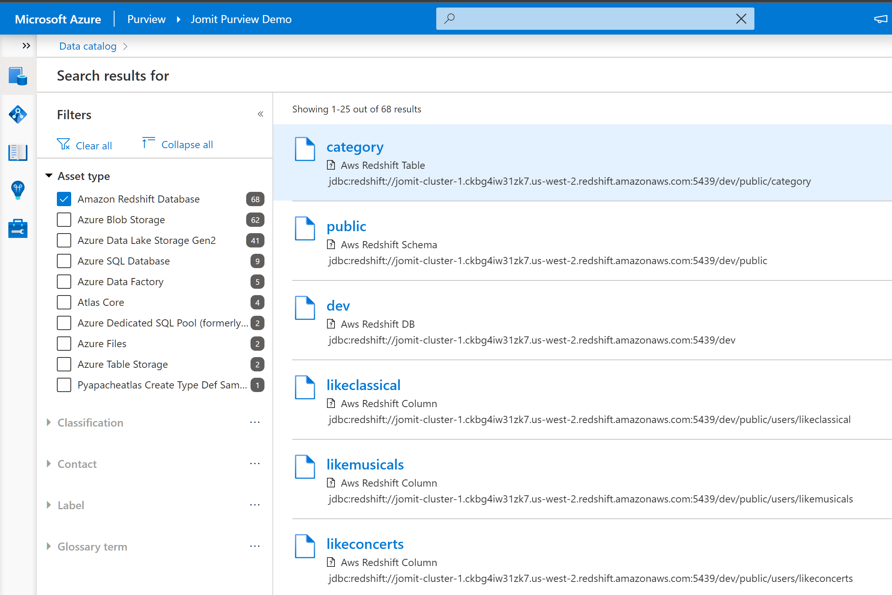
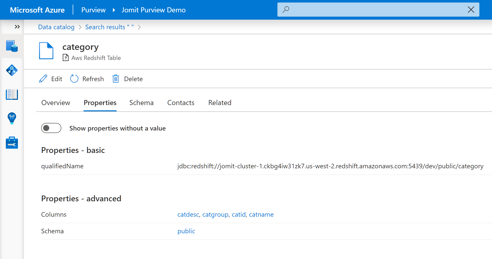
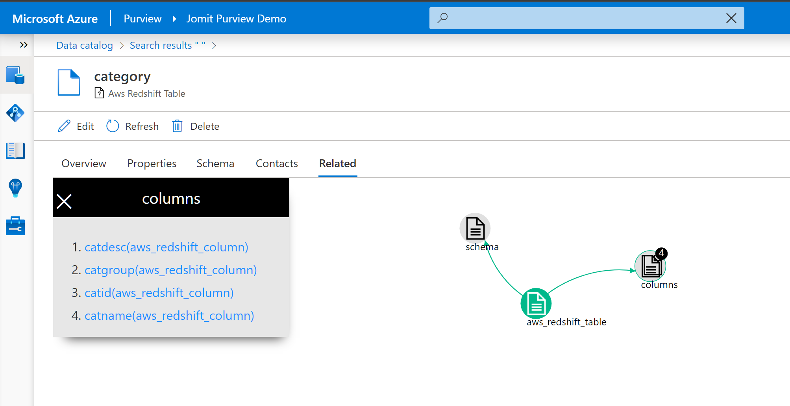

### Sample to Export Redshift Metadata and Create Custom entities in Purview

- Install and configure ODBC drivers for Redshift from [here](https://docs.aws.amazon.com/redshift/latest/mgmt/configure-odbc-connection.html)

- Update Redshift connection details in `config.ini`

- `pip install pyodbc`
- `pip install pandas`

- `python .\import_redshift_custom.py` 

